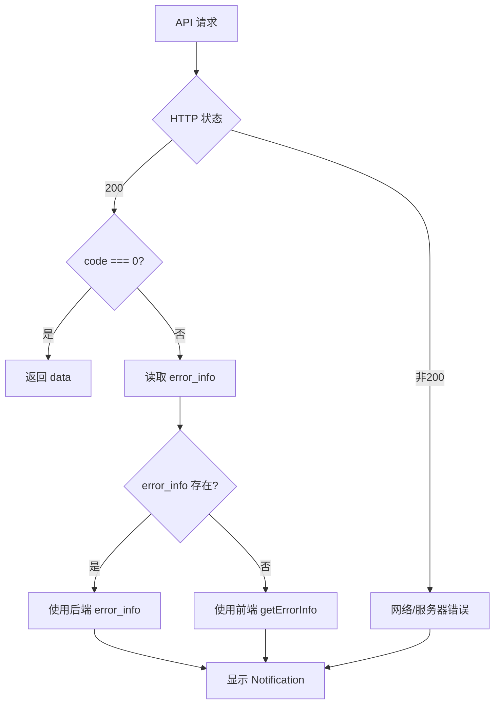

# 前端错误提示规范

## 📋 概述

本文档定义了管理后台前端（Vue Arco Pro）在处理 API 错误时的统一规范，确保用户获得友好、一致的错误提示体验。

---

## 🎯 设计原则

### 1. 用户友好优先

- **避免技术术语**: 不直接暴露 SQL、堆栈等技术细节
- **提供明确指引**: 告诉用户为什么失败 + 如何解决
- **友好的语气**: 使用"请"等礼貌用语

### 2. 信息层次分明

```
┌─────────────────────────┐
│ 标题 (title)            │  ← 错误分类（如"商品操作失败"）
│ 详细信息 (message)      │  ← 具体错误原因
│ 建议 (suggestion)       │  ← 解决方案提示
│ 技术信息 (可选)         │  ← trace_id（仅开发环境）
└─────────────────────────┘
```

### 3. 一致性保证

- 后端 `ApiResponse::getErrorInfo()` 与前端 `getErrorInfo()` **完全同步**
- 错误码范围映射保持统一

---

## 🔧 实现机制

### 响应结构 (ExtendedHttpResponse)

```typescript
interface ExtendedHttpResponse<T = unknown> {
  code: number;              // 业务错误码（0 为成功）
  message: string;           // 具体错误信息
  data: T;                   // 业务数据
  timestamp?: number;        // 时间戳
  error_info?: {             // 后端返回的错误提示（优先级高）
    title: string;           // 错误标题
    suggestion: string;      // 建议操作
  };
  trace_id?: string;         // 追踪ID（用于排查）
}
```

### 错误处理流程



---

## 📊 错误码范围与提示策略

### 系统级错误 (4000-4099)

| 错误码范围 | 分类 | Notification 类型 | 标题 | 建议 |
|-----------|------|------------------|------|------|
| `4000` | 参数验证 | warning | 数据验证失败 | 请检查输入的数据是否正确 |
| `4001` | 未授权 | error | 身份验证失败 | 请重新登录后再试 |
| `4002` | 权限不足 | warning | 权限不足 | 请联系管理员申请相关权限 |
| `4003` | 资源不存在 | warning | 资源不存在 | 请刷新页面后重试 |
| `4004` | 请求过频 | warning | 请求过于频繁 | 请稍后再试 |
| `5000-5099` | 服务器错误 | error | 服务器错误 | 服务器出现问题，请稍后重试或联系技术支持 |

### 业务模块错误 (2000-9999)

| 错误码范围 | 业务模块 | Notification 类型 | 标题 | 建议 |
|-----------|---------|------------------|------|------|
| `2000-2999` | 用户模块 | warning | 用户操作失败 | 请检查账户状态或联系客服 |
| `3000-3999` | 商品模块 | warning | 商品操作失败 | 商品可能已下架或库存不足，请刷新后重试 |
| `4100-4199` | 订单模块 | warning | 订单操作失败 | 请检查订单状态是否允许当前操作 |
| `5000-5099` | 支付模块 | warning | 支付失败 | 请检查支付信息或更换支付方式 |
| `5030-5039` | 售后退款 | warning | 售后操作失败 | 请检查售后申请状态或联系客服 |
| `5040-5049` | 提现模块 | warning | 提现操作失败 | 请检查余额和提现金额是否符合要求 |
| `5050-5059` | 发票模块 | warning | 发票操作失败 | 请检查订单支付状态或发票信息 |
| `6000-6999` | 购物车 | warning | 购物车操作失败 | 商品可能已下架或库存变动，请刷新后重试 |
| `7000-7999` | 优惠券 | warning | 优惠券使用失败 | 请检查优惠券是否过期或使用条件 |
| `8000-8999` | 广告模块 | warning | 广告操作失败 | 请检查广告配置或关联数据 |
| `9000-9999` | 营销活动 | warning | 活动参与失败 | 请检查活动时间和参与条件 |

---

## 🎨 UI 展示规范

### Notification 配置

```typescript
// ✅ 推荐：分级展示
Notification[errorInfo.type]({
  title: errorInfo.title,                    // 错误分类
  content: `${message}\n\n${errorInfo.suggestion}${footerInfo}`,
  duration: 8000,                           // 8秒自动关闭
  closable: true,                           // 允许手动关闭
});
```

### 验证错误特殊处理

Laravel 验证错误（`data.errors`）需格式化显示:

```typescript
// ✅ 示例：格式化验证错误
if (res.data?.errors) {
  const errors = res.data.errors as Record<string, string[]>;
  content = formatValidationErrors(errors); // • 名称: 名称不能为空
}

function formatValidationErrors(errors: Record<string, string[]>): string {
  return Object.entries(errors)
    .map(([field, messages]) => {
      const fieldName = fieldNameMap[field] || field;
      return messages.map(msg => `• ${fieldName}: ${msg}`).join('\n');
    })
    .join('\n');
}
```

### 开发环境额外信息

```typescript
// ✅ 开发环境显示 trace_id
if (res.trace_id && import.meta.env.DEV) {
  footer.push(`追踪ID: ${res.trace_id}`);
}
```

---

## 🚫 反模式（禁止操作）

### ❌ 直接使用 Message

```typescript
// ❌ 错误：Message 会被其他消息覆盖，且无详细信息
Message.error(res.message);
```

### ❌ 忽略 error_info

```typescript
// ❌ 错误：后端已提供 error_info，不应重复计算
const errorInfo = getErrorInfo(res.code); // 应先检查 res.error_info
```

### ❌ 暴露技术细节

```typescript
// ❌ 错误：直接显示异常堆栈
Notification.error({
  content: error.stack, // 用户无法理解
});
```

### ❌ 认证错误使用 Notification

```typescript
// ❌ 错误：认证失败应使用 Modal 强制处理
if (code === 4001) {
  Notification.error({ ... }); // 用户可能忽略
}

// ✅ 正确：使用 Modal 强制交互
if (code === 4001) {
  Modal.error({
    title: '登录过期',
    content: '您的登录已过期，请重新登录',
    okText: '重新登录',
    onOk: () => {
      userStore.logout();
      router.push('/login');
    },
  });
}
```

---

## 📝 字段名称映射（可扩展）

为提升用户体验，字段名应本地化:

```typescript
const fieldNameMap: Record<string, string> = {
  name: '名称',
  email: '邮箱',
  password: '密码',
  mobile: '手机号',
  title: '标题',
  content: '内容',
  price: '价格',
  stock: '库存',
  start_time: '开始时间',
  end_time: '结束时间',
  // 持续扩展...
};
```

---

## 🔍 调试与排查

### trace_id 追踪

1. **前端获取**: 响应 `res.trace_id`（开发环境显示在 Notification）
2. **后端查询**: 通过 trace_id 在日志中搜索完整请求链路
3. **日志上下文**:
   ```php
   Log::withContext([
       'trace_id' => $traceId,
       'request_id' => $request->headers->get('X-Request-Id'),
       'path' => $request->path(),
       'user_id' => optional($request->user())->id,
   ]);
   ```

### 常见问题排查

| 现象 | 可能原因 | 排查方法 |
|-----|---------|---------|
| 错误提示不友好 | 后端直接抛出 Exception | 检查是否使用 BusinessException |
| 错误码不匹配 | 前后端 getErrorInfo 不同步 | 对比两处实现 |
| trace_id 缺失 | 未通过全局异常处理器 | 检查是否在控制器直接返回 |

---

## ✅ 检查清单

开发新功能时，请确认:

- [ ] 后端使用 `BusinessException` 而非 `Exception`
- [ ] 错误码使用 `ErrorCode` 常量
- [ ] 前端 `getErrorInfo()` 已更新（如新增错误码范围）
- [ ] 验证错误正确格式化
- [ ] 认证错误使用 Modal 而非 Notification
- [ ] 开发环境显示 trace_id
- [ ] 字段名称已本地化

---

## 📚 相关文档

- [错误处理规范](/api/guidelines/error-handling)
- [常见错误码使用指南](/api/guidelines/error-codes)
- [API 概览](/api/overview)

---

::: tip 提示
本文档与后端 `ApiResponse::getErrorInfo()` 保持同步。修改错误提示策略时，请同时更新两处代码。
:::

